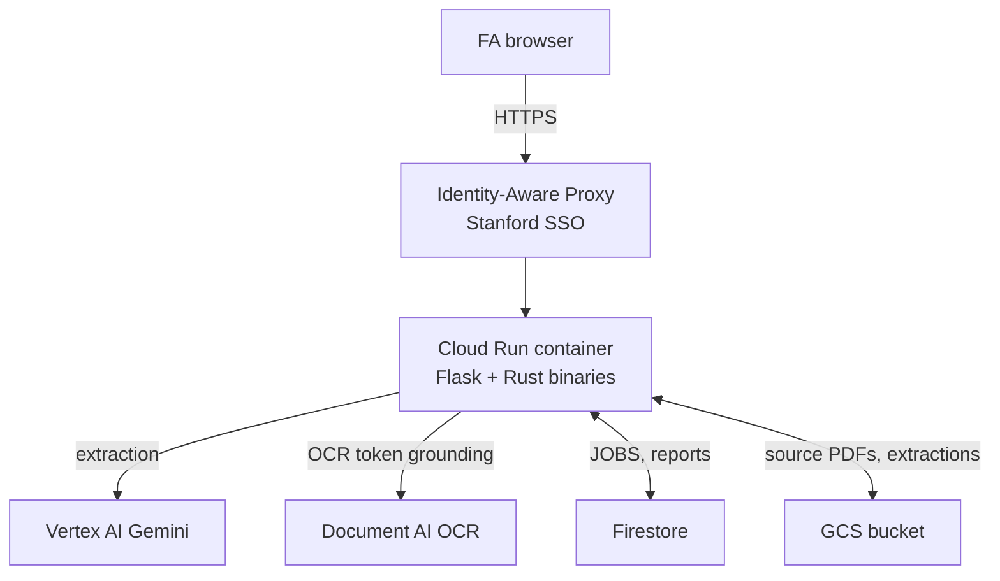

# Stanford Expense Reports

AI-assisted expense-report extraction for Stanford Faculty
Administrators. Upload receipt PDFs and images; the system extracts
structured fields with Gemini and Document AI, validates against
Stanford expense-portal rules, and emits two CSVs ready for upload
to the Stanford portal.

Two load-bearing properties:

- Extraction is reliable enough that FAs do not re-key fields.
  Every extracted value carries confidence and provenance; FA
  edits supersede extracted values.
- The deployed service survives container recycles. Firestore +
  GCS hold durable state; container disk is a cache.

## Architecture



One Cloud Run service behind Stanford SSO. Vertex AI does the
structured extraction; Document AI provides OCR bboxes the
workbench uses for spot-check highlighting. Firestore and GCS
hold durable state.

## Setup

Prerequisites:

- `gcloud` CLI
- Python 3.12+
- Rust toolchain (`cargo`)
- Access to a GCP project with Vertex AI, Document AI, Firestore,
  and GCS enabled

### Python environment

Project metadata + dependencies live in `pyproject.toml`. The
`uv.lock` lockfile pins exact versions for reproducible installs.

**Option A — `uv` (recommended)**

```bash
# Install uv if not present: https://docs.astral.sh/uv/
uv sync                          # creates .venv/, installs runtime + dev deps
.venv/bin/playwright install chromium
```

`uv sync` is idempotent: re-run it any time `pyproject.toml` or
`uv.lock` changes. To add a runtime dependency:

```bash
uv add <package>
uv export --no-hashes --no-emit-project --no-dev \
  --output-file deploy/requirements.txt    # keep Docker build in sync
```

`deploy/requirements.txt` is autogenerated from the lockfile and
consumed by the Dockerfile. Do not edit it by hand.

**Option B — `venv` + pip**

```bash
python3.12 -m venv .venv
.venv/bin/pip install --upgrade pip
.venv/bin/pip install -r deploy/requirements.txt
.venv/bin/pip install playwright
.venv/bin/playwright install chromium
```

### Rust + GCP auth

```bash
cargo build

gcloud auth login
gcloud auth application-default login
gcloud config set project <gcp-project>
```

## Run locally

```bash
PORT=8088 VERTEX_PROJECT_ID=<gcp-project> \
  USE_FIRESTORE_JOBS=1 USE_FIRESTORE_REPORTS=1 USE_GCS_ARTIFACTS=1 \
  ./.venv/bin/python scripts/local_app_simple.py
```

Open `http://127.0.0.1:8088`. Each upload incurs Vertex AI and
Document AI charges against the configured project.

If your account lacks personal IAM on the project, request a
service-account JSON key from the project admin. See
`docs/deployment-guide.md` §5.2.

## Test

```bash
cargo test
./.venv/bin/python -m unittest discover -s tests -p "test_*.py"
```

Production end-to-end tests (real API costs, approximately USD 3
per full suite):

```bash
RUN_PROD_E2E=1 VERTEX_PROJECT_ID=<gcp-project> \
  ./.venv/bin/python -m unittest tests.test_workbench_browser -v
```

Mermaid diagram validation:

```bash
./.venv/bin/python scripts/validate_mermaid_docs.py
```

## Deploy

```bash
git push origin main
```

The Cloud Build trigger fires, runs tests, builds the image, and
deploys to Cloud Run. See `docs/deployment-guide.md` §6.5 when
the deploy fails.

## Doc map

| Doc | Purpose |
|---|---|
| `docs/SPEC.md` | Architecture spec with diagrams |
| `docs/internals.md` | Mechanism reference: extraction, validation, persistence, concurrency, refresh resilience, CI/CD |
| `docs/deployment-guide.md` | Stand-up runbook, service-account JSON setup, Cloud Build debug |
| `docs/deploy-cheatsheet.md` | Operational facts for the active deployment (URLs, IAM, region) |
| `docs/fa-user-guide.md` | End-user website usage |

## Repository layout

- `scripts/` — Python: Flask app, per-kind extractors, codegen, Firestore + GCS clients
- `src/` — Rust: reduce, validate, render, CSV export; binaries in `src/bin/`
- `generated/` — codegen output from `schema.yaml`. Do not edit.
- `templates/` — Flask HTML templates
- `deploy/` — `Dockerfile`, `cloudbuild.yaml`, `requirements.txt`
- `tests/` — Python tests; Rust tests live in `src/`
- `reference/` — Stanford-supplied ERS templates and portal screenshots
- `receipts/` — fixture receipts for local and prod tests
- `visualizer/` — standalone React schema browser (`cd visualizer && npm install && npm run dev`)

## Source reading order

For a real task (bug fix or feature). Each file is a focused unit.

Python pipeline:

1. `scripts/local_app_simple.py` — Flask routes and pipeline
   orchestration. ~1700 lines.
2. `scripts/extract_meal.py` — simplest per-kind extractor.
3. `scripts/extractor_lib.py` — shared Gemini call, retry wrapper,
   multi-call helper.
4. `scripts/evidence_bbox.py` — Document AI OCR and token-id
   grounding.

Rust pipeline:

5. `src/reduce.rs` — combines per-receipt JSONs into one
   `ExpenseReport`. Pure function.
6. `src/validator_typed.rs` — validates the report; never mutates.
7. `src/workbench_simple.rs` — renders FA-facing HTML. ~2000 lines.
8. `src/csv_export.rs` — emits the two Stanford-portal CSVs.

Type contracts:

9. `schema.yaml` — source of truth for every field shape and rule.
10. `generated/expense_report_model.rs` — generated Rust types.
11. `src/meta.rs` — `Wrapped<T>` and `FieldMetadata`. Every
    extracted field is wrapped with confidence and evidence.

## Change cookbook

| Task | Read | Edit |
|---|---|---|
| Add a new expense kind | `internals.md` §4 | `schema.yaml`, regenerate, new `extract_*.py`, workbench render arm, validator arm |
| Add a validation rule | `internals.md` §7 | `schema.yaml` for declarative; `validator_typed.rs` for procedural |
| Change a workbench field label or format | `internals.md` §7 | `src/workbench_simple.rs` |
| Tune Gemini retry behavior | `internals.md` §6.3 | `scripts/extractor_lib.py::RETRY_MAX_ATTEMPTS` and `_retry_with_backoff` |
| Bump extract concurrency | `internals.md` §6.1 | `EXTRACT_MAX_PARALLEL` env var |
| Persist a new field across recycle | `internals.md` §8 | `firestore_reports.set_report` and `_rehydrate_upload` |
| Add a deploy env var | `internals.md` §9.4 | `deploy/cloudbuild.yaml` `--set-env-vars` |

## Known traps

| Trap | Required behavior |
|---|---|
| Editing `schema.yaml` without regenerating | Run `generate_schema_artifacts.py` and `generate_response_schema.py`. For per-kind detail-block changes also run `probe_response_schemas.py`. |
| Adding a Firestore field with arrays-of-arrays | JSON-encode as a string. Firestore rejects directly-nested arrays. |
| Inline `python -c` for introspection | Use a script in `scripts/`. |
| Writing to `/tmp` | Use `.scratch/` (gitignored). |
| Trusting `cmd \| tee \| tail; echo $?` | Exit code is `tail`'s. Inspect output for failure markers or set `pipefail`. |
| Adding HTML5 validation without a Playwright load test | Chromium `/v` mode is stricter than JS `/u`. `tests/test_workbench_browser.py::test_upload_form_loads_with_all_fa_fields` is the guard. |
| Editing `src/workbench_simple.rs` HTML without an eyeball | Render a fixture and load in a browser. `cargo test` does not catch visual regressions. |

## Conventions

See `CLAUDE.md` for non-negotiable workflow rules.
