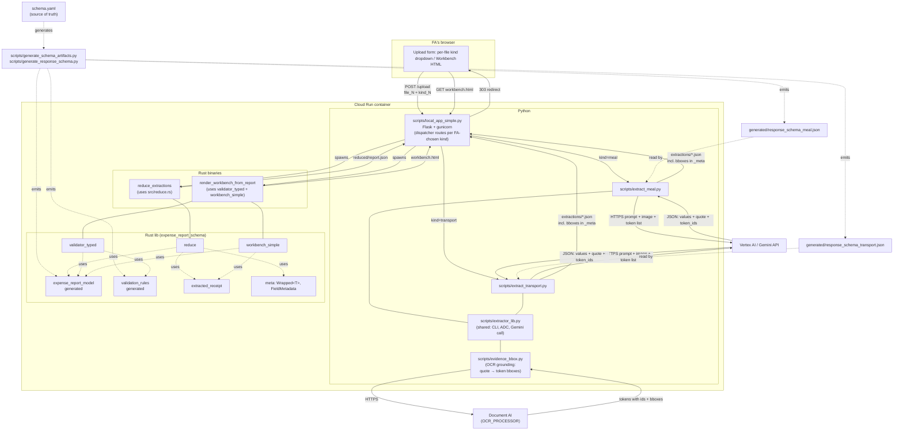
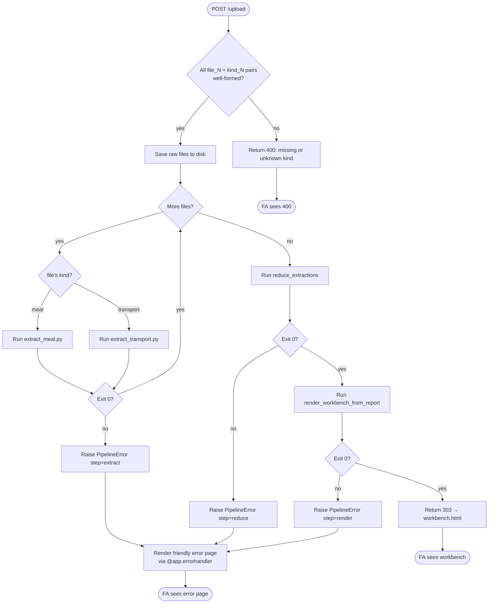
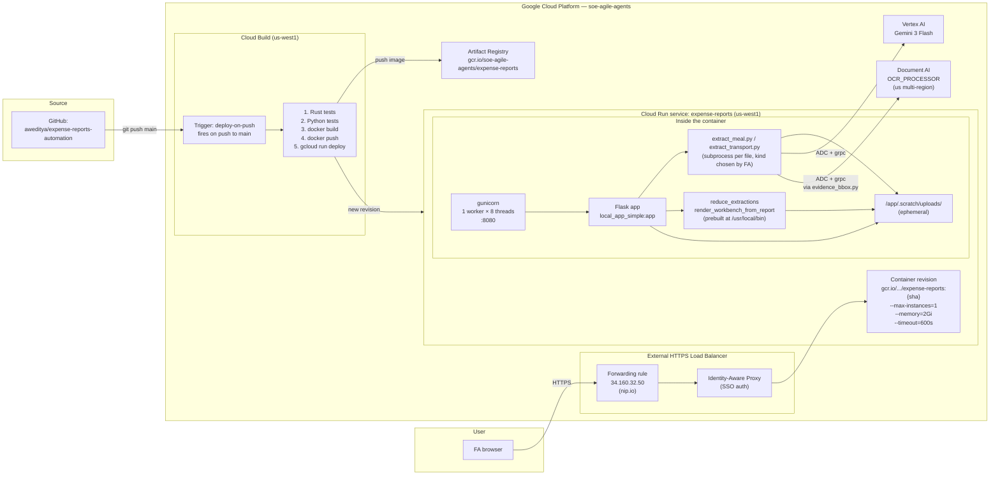
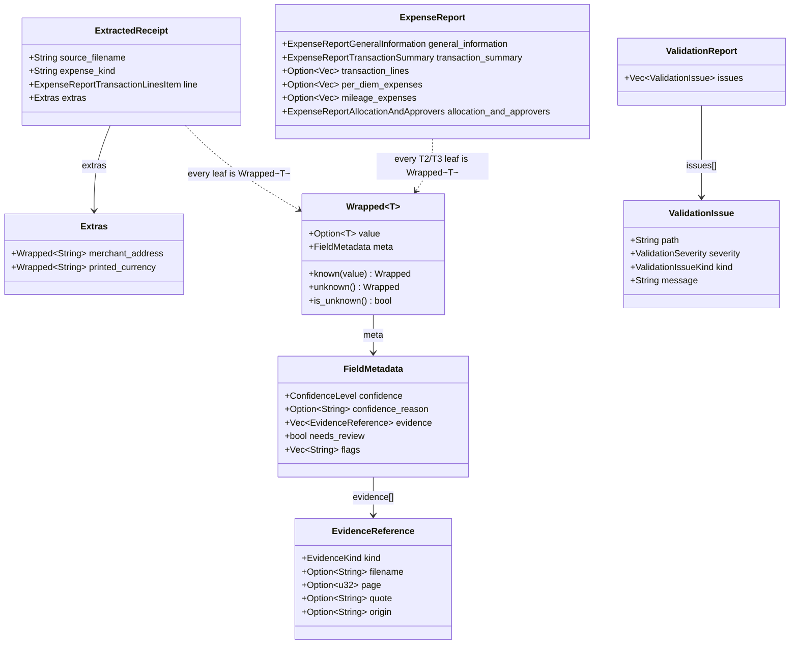

# SPEC

Architecture reference for the Stanford expense-report extraction
pipeline. Describes **the system as it stands today** — what the layers
are, what each one is responsible for, how data flows between them, and
what runs where in production.

For the *history* of how we got here, see `redesign-plan.md` and
`redesign-regrets.md`. For the *deploy* facts (URLs, region, IAM, etc.)
see `deploy-cheatsheet.md`. This file is the architecture, not the
incident log and not the runbook.

All diagrams are Mermaid; GitHub renders them inline.

---

## 1. Layer model

The pipeline is a strict 6-layer cake. Each layer's only job is to
consume the previous layer's output and produce the next layer's input.
If a piece of code touches two layers' worth of concern, it is wrong.

| # | Layer | Implemented in | Owns |
|---|---|---|---|
| 1 | **Extraction** | `scripts/extract_<kind>.py` (one per expense kind) | One Gemini call per uploaded document — receipt image → typed JSON — for most kinds (meal, transport). Kinds whose detail block exceeds Vertex's schema property-count ceiling (lodging today; > ~5 `_meta`-wrapped T2/T3 leaves) make **two parallel calls** with their schema split across them; the per-kind script merges the outputs back into the same per-doc JSON shape. The dispatcher in `local_app_simple.py` picks the script based on the FA's per-file kind choice in the upload form. See §7 for when to use the multi-call pattern. **Each extractor also makes ONE Document AI OCR call per document BEFORE Gemini** (Leapfrog L.3–L.5; docs/leapfrog-plan.md): DocAI's numbered token list gets appended to Gemini's prompt; Gemini returns the value + a verbatim `quote` + `token_ids` (integer indices into the token list) per `document_span` evidence entry. After Gemini returns, `scripts/evidence_bbox.py::populate_bboxes` resolves `token_ids` to bboxes via dict lookup. A Levenshtein verifier (threshold 0.7) catches Gemini-hallucinated IDs; on rejection (or absent token_ids) the code falls back to the legacy text-matching path against the same DocAI tokens. Either way bboxes land in `_meta.evidence[].bboxes` — pure metadata the workbench reads at render time to draw a spot-check halo. OCR failure is non-fatal: extraction proceeds, bboxes are absent, workbench falls back to "no halo." |
| 2 | **Derivation** | (inside extraction) | Fields a single document can yield from its own contents. No cross-document signal. |
| 3 | **Reduction** | `src/reduce.rs` | Combines per-document JSONs into one `ExpenseReport`. Aggregations like `total_usd`, `transaction_date`, derived `category` + confidence. |
| 4 | **Validation** | `src/validator_typed.rs` (+ `src/validator.rs`) | Checks the assembled `ExpenseReport` against business rules. Produces `ValidationReport` (issues only — never mutates the report). |
| 5 | **Display** | `src/workbench_simple.rs` (+ `src/workbench_simple.css`) | Renders typed report + validation issues into the FA-facing workbench HTML. Pure formatting; no business decisions. |
| 6 | **Submission** | (not implemented) | Future: translate the internal model into Stanford's portal API payload. Today the FA reads the workbench and submits manually. |

The key invariants:

- **Reduction never reads from outside `[ExtractedReceipt]`.** It cannot fetch external data, call APIs, or look at the filesystem.
- **Validation takes `&ExpenseReport`** (immutable borrow). The type system literally forbids it from changing values; it can only emit issues.
- **Display takes everything and produces a `String`.** No side effects.
- **The orchestrating binary calls the layers in order**: reduce → validate → render. Never out of order, never reverse.

---

## 2. Component diagram

What each module is and how they wire together.



---

## 3. Sequence diagram — one upload, end to end

The temporal flow from "FA clicks Process Receipts" to "FA sees the
workbench."

```mermaid
sequenceDiagram
    actor FA
    participant Browser
    participant IAP as Google IAP
    participant Flask as Flask (gunicorn + dispatcher)
    participant Extract as extract_(kind).py
    participant Gemini as Gemini API
    participant DocAI as Document AI
    participant Reduce as reduce_extractions (Rust)
    participant Render as render_workbench_from_report (Rust)
    participant Disk as .scratch/uploads/{id}/

    FA->>Browser: pick files + kind per file, click Process Receipts
    Browser->>IAP: POST /upload (multipart with file_N + kind_N pairs)
    IAP->>Flask: forwarded request (auth verified)
    Flask->>Disk: save raw files to files/

    loop for each (uploaded file, kind) pair
        Note over Flask: dispatcher picks extract_meal.py or<br/>extract_transport.py from FA's kind choice
        Flask->>Extract: subprocess: --image f --output extractions/f.json
        Extract->>DocAI: process_document(image)
        DocAI-->>Extract: tokens (id, text, bbox)
        Note over Extract: format_tokens_for_prompt:<br/>append numbered token list to prompt
        Extract->>Gemini: generate_content(prompt+tokens, image, response_schema)
        Gemini-->>Extract: structured JSON (values + quote + token_ids)
        Note over Extract: populate_bboxes (dual path):<br/>token_ids -> dict lookup + verifier;<br/>fallback to text-match the quote
        Extract->>Disk: write extractions/{name}.json
        Extract-->>Flask: exit 0
    end

    Flask->>Reduce: subprocess: --in extractions/ --out reduced/report.json
    Reduce->>Disk: read all extractions/*.json
    Reduce->>Disk: write reduced/report.json
    Reduce-->>Flask: exit 0

    Flask->>Render: subprocess: --report reduced/... --receipts-dir extractions/ --out workbench.html
    Render->>Disk: read report.json + extractions
    Note over Render: validate_typed(&report)<br/>render_workbench_html(report, receipts, validation)
    Render->>Disk: write workbench.html
    Render-->>Flask: exit 0

    Flask-->>IAP: 303 See Other → /uploads/{id}/workbench.html
    IAP-->>Browser: 303
    Browser->>IAP: GET /uploads/{id}/workbench.html
    IAP->>Flask: forwarded GET
    Flask->>Disk: send_from_directory
    Flask-->>Browser: HTML
    Browser-->>FA: rendered workbench
```

---

## 4. Activity diagram — per-upload control flow

The decision flow inside a single upload, including failure paths.



---

## 5. Block diagram — deployment topology

What runs where in production.



Notes:

- The container runs **gunicorn**, not `flask run`. `--workers=1` matches `--max-instances=1` (single instance, single worker, threads handle concurrency).
- Storage under `/app/.scratch/uploads/` is **ephemeral** — destroyed when the container restarts. Production-acceptable today because the FA workflow is "upload → review immediately"; long-term retention would need GCS.
- **Auth**: the public URL is fronted by IAP, which gates on SSO. Cloud Run itself is `--no-allow-unauthenticated`. Vertex calls from inside the container use the runtime service account via ADC (no key file).
- Deploy gesture: `git push origin main`. The trigger is **regional (us-west1)** — see `deploy-cheatsheet.md`.

---

## 6. Class diagram — the type contract

The Rust types that flow between layers. The same shape is what the
Python extractor produces (deserialized via serde).



The single most important shape rule: **every T2 (system-derived) and
T3 (extracted) leaf is a `Wrapped<T>` carrying its own `_meta`**. T1
(FA-entered) leaves are bare `Option<T>` because they don't have model
provenance — the FA filled them in.

---

## 7. Layer responsibility table

A cheat-sheet for "which file does X belong in?"

| Need to … | Lives in | Layer |
|---|---|---|
| Add a per-document field Gemini extracts | `schema.yaml` + `scripts/extract_<kind>.py` (prompt) + regenerate | Extraction |
| Compute a per-receipt value from other per-receipt values | `scripts/extract_<kind>.py` (in the same call) or post-process in Python before write | Derivation |
| Aggregate across receipts (sum, earliest, derived enum) | `src/reduce.rs` | Reduction |
| Add a business rule (e.g. "X required when Y") | `schema.yaml` (`required:` clause, regenerates `validation_rules.rs`) and/or hand-coded in `src/validator_typed.rs` | Validation |
| Change how a field looks on the workbench | `src/workbench_simple.rs` + `src/workbench_simple.css` | Display |
| Future: emit a Stanford-portal payload | new `src/submit.rs` (does not exist yet) | Submission |
| Add a new expense kind (hotel/cab/airfare/conference) | (1) per-kind detail block already in `schema.yaml`; (2) `scripts/generate_response_schema.py` — add the kind to `KIND_EXPENSE_TYPES` + a detail-block factory + an entry in `SCHEMAS_TO_GENERATE`; (3) new `scripts/extract_<kind>.py` (~30 lines using `run_extraction` from `extractor_lib`); (4) new dropdown option + dispatcher entry in `scripts/local_app_simple.py`; (5a) **add `render_<kind>_details(html, <kind>, path)` in `src/workbench_simple.rs` mirroring `render_lodging_details` / `render_airfare_details`**; (5b) **add the corresponding `if let Some(<kind>) = &line.<kind>_details` branch in `render_transaction_line`**; (5c) extend `line_summary_headline` with a per-kind headline; (5d) walk the new detail block in `src/validator_typed.rs`; (6) acceptance harness entries in `scripts/acceptance_check.py` (`EXTRACTORS` + `DETAIL_BLOCK_BY_KIND` + per-receipt fixtures with predicates). The Dockerfile globs `generated/response_schema_*.json`, so no Dockerfile change. Mental check: upload a {kind} receipt — does the FA see all the {kind}-specific fields on the workbench? If no, step (5) isn't done. **If the detail block has more than ~5 T2/T3 leaves** (Vertex's schema property-count ceiling), it needs the multi-call pattern: emit multiple schemas from `SCHEMAS_TO_GENERATE` (with `include_common`/`include_detail`/`include_extras` knobs) and orchestrate parallel `single_call` invocations + merge in the extractor — see `scripts/extract_lodging.py` (2-call) or `scripts/extract_airfare.py` (3-call when the detail block is too big to fit in one main call). | Extraction + Display + Validation |

---

## 8. Implementation file map

| Concern | File |
|---|---|
| Schema source of truth | `schema.yaml` |
| Codegen — Rust types + validation rules | `scripts/generate_schema_artifacts.py` |
| Codegen — Gemini response_schema | `scripts/generate_response_schema.py` |
| Generated Rust types | `generated/expense_report_model.rs` |
| Generated validation-rule constants | `generated/validation_rules.rs` |
| Generated response_schemas (per call) | `generated/response_schema_meal.json`, `generated/response_schema_transport.json`, `generated/response_schema_lodging_main.json`, `generated/response_schema_lodging_extras.json`, `generated/response_schema_airfare_main.json`, `generated/response_schema_airfare_aux.json`, `generated/response_schema_airfare_extras.json` (lodging is split across 2 parallel calls; airfare across 3 — see §1 and §7) |
| Per-document I/O type | `src/extracted_receipt.rs` (incl. `Extras`, `NightlyRate`, `Segment` bare-array entries) |
| Provenance wrapper + metadata | `src/meta.rs`, `src/draft.rs` |
| Reduction | `src/reduce.rs` |
| Traversal-driven validation | `src/validator_typed.rs` |
| Validator types | `src/validator.rs` |
| Workbench HTML renderer | `src/workbench_simple.rs` (+ `src/workbench_simple.css`) |
| Reduction binary | `src/bin/reduce_extractions.rs` |
| Render binary | `src/bin/render_workbench_from_report.rs` |
| Round-trip contract check | `src/bin/roundtrip_check.rs` |
| Per-kind Python extractors (Gemini call) | `scripts/extract_meal.py`, `scripts/extract_transport.py`, `scripts/extract_lodging.py` (orchestrates 2 parallel calls via `ThreadPoolExecutor` and merges), `scripts/extract_airfare.py` (orchestrates 3 parallel calls — main/aux/extras — and 1-deep-merges `airfare_details` from main+aux) |
| Shared extractor infrastructure | `scripts/extractor_lib.py` (CLI parsing, ADC client, `single_call` primitive, `run_extraction` for single-call kinds) |
| OCR grounding (per-doc Document AI call + dual-path bbox resolution) | `scripts/evidence_bbox.py` (`ocr_document` runs BEFORE Gemini so the token list can be inlined into Gemini's prompt; `populate_bboxes` resolves `token_ids` via dict lookup + Levenshtein verifier, falls back to text-matching for entries without token_ids or whose verifier failed; ~$0.0015/doc, ~1–3s latency) |
| Retrofit cached per-doc JSONs with bboxes | `scripts/retrofit_bboxes.py` (one-shot batch over `.scratch/spike/*.json`, lets workbench be validated without re-running Gemini) |
| Evidence + bbox coverage audit | `scripts/spike_evidence_audit.py` (walks `.scratch/spike/*.json` and emits `.scratch/audit/evidence_coverage.txt` with per-receipt and per-field-path coverage stats + miss list) |
| Leapfrog architecture spike (kept as historical artifact) | `scripts/spike_leapfrog.py` (5-receipt + corpus-scale spike that validated token-id grounding at 100/100 verifier pass; informed L.1–L.5), `scripts/spike_leapfrog_retrofit.py` (one-shot UI overlay tool used during L.0 visual sanity-check; superseded by L.3–L.5 production wiring) |
| Leapfrog design doc | `docs/leapfrog-plan.md` |
| Schema-acceptance pre-deploy probe | `scripts/probe_response_schemas.py` (sends a 1×1 PNG generate_content per generated schema; catches Vertex-rejected schemas before push) |
| Flask + gunicorn entry point | `scripts/local_app_simple.py` |
| Acceptance harness | `scripts/acceptance_check.py` |
| Manual deploy escape hatch | `scripts/deploy.sh` |
| Cloud Build pipeline | `deploy/cloudbuild.yaml` |
| Container | `deploy/Dockerfile` |
| Runtime deps | `deploy/requirements.txt` |

If a file isn't on this list, it shouldn't exist in the active
codebase. The non-active files are docs (`docs/*.md`), the test fixture
(`tests/test_deploy_config.py`), the unrelated `visualizer/` Vite app,
domain reference PDFs in `reference/`, and the receipts corpus in
`receipts/`.
