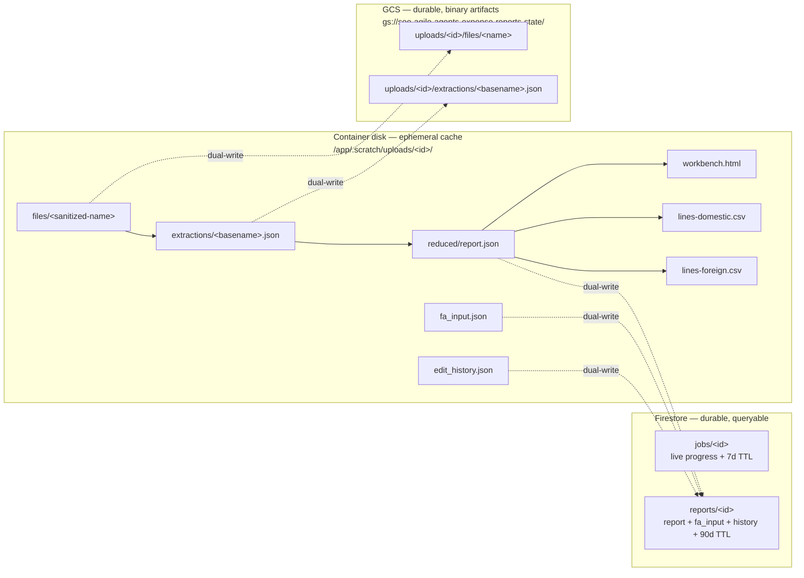
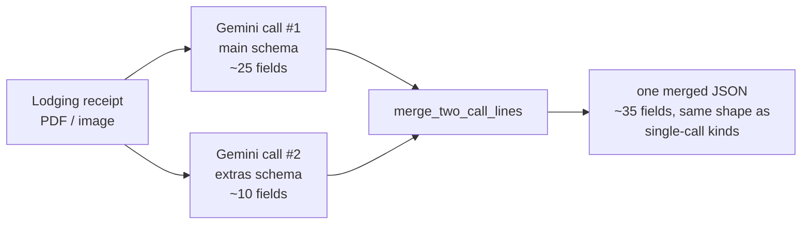
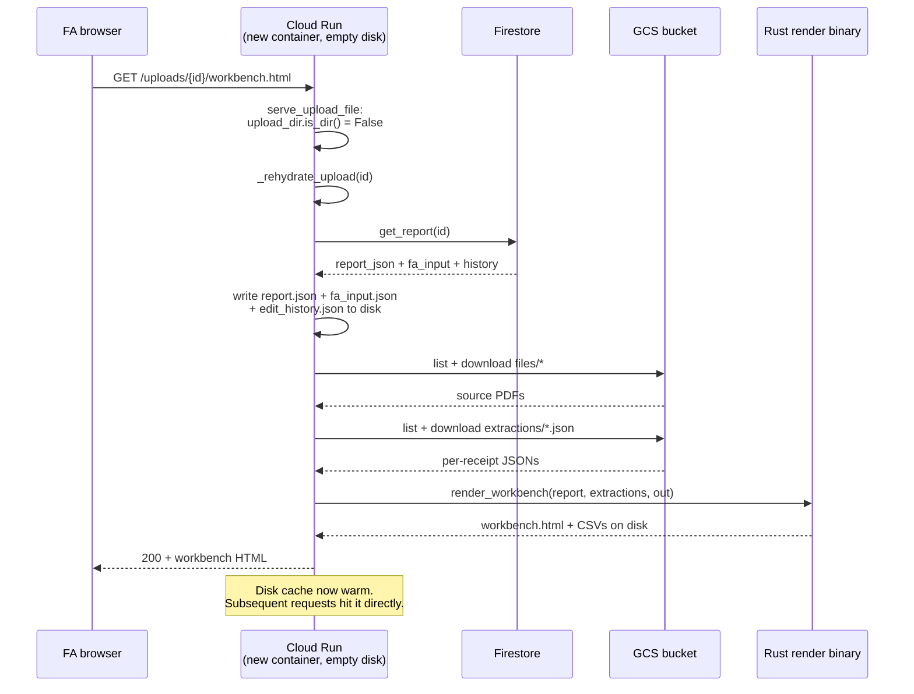
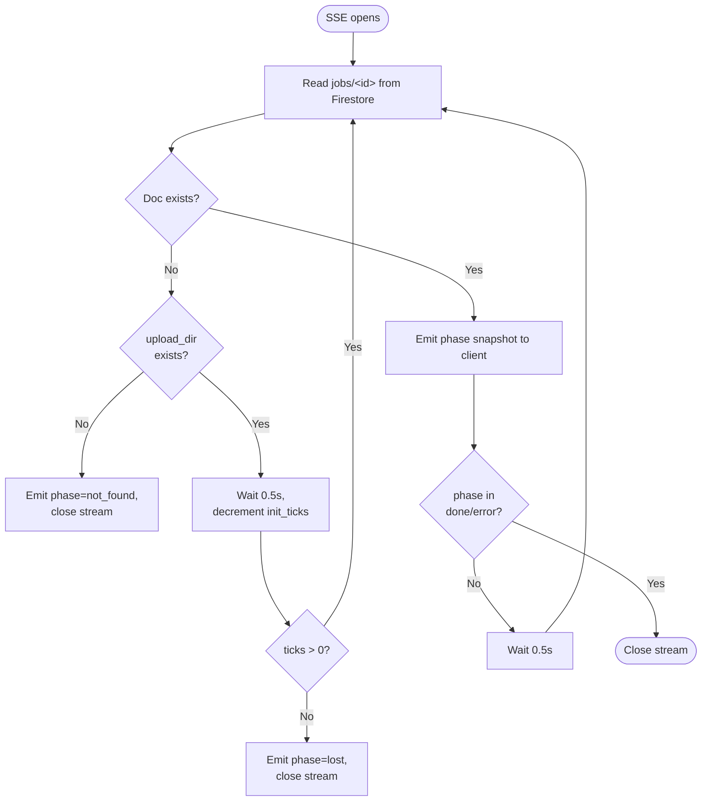

# Internals

The "how" of the codebase, organized by mechanism rather than by
file. Companion to `SPEC.md` (the "what" — the layered architecture)
and `deployment-guide.md` (the "where it runs"). Read in this order if
you're new:

1. `fa-user-guide.md` — what the FA sees (1 page)
2. `SPEC.md` — architecture spec (skim §1, §2, §5)
3. **this file** — pick the section relevant to what you're changing
4. `deployment-guide.md` — when you need to deploy or debug ops

Each section answers one question. Skip what's not relevant.

---

## 1. Where does code live?

```
schema.yaml                        # Source of truth for all field shapes + validation rules
scripts/
├── local_app_simple.py            # Flask app — routes, dispatcher, pipeline orchestration
├── extract_<kind>.py              # Per-kind extractors (meal/transport/lodging/airfare/...)
├── extractor_lib.py               # Shared Gemini call + retry + multi-call helper
├── evidence_bbox.py               # Document AI OCR + token-id grounding → bbox
├── fx_enrich.py / fx_lookup.py    # Frankfurter FX rate lookups
├── firestore_jobs.py              # Live-progress JOBS dict (Phase 1 durable store)
├── firestore_reports.py           # Reduced reports + edits (Phase 2a)
├── gcs_artifacts.py               # Source PDFs + extraction JSONs (Phase 2b)
├── generate_schema_artifacts.py   # schema.yaml → generated/expense_report_model.rs + validation_rules.rs
└── generate_response_schema.py    # schema.yaml → generated/response_schema_<kind>_<call>.json (one per Gemini call)

src/
├── reduce.rs                      # Combine per-receipt JSONs → ExpenseReport
├── validator_typed.rs             # Validate ExpenseReport → ValidationReport (issues only)
├── workbench_simple.rs            # Render ExpenseReport + issues → workbench.html
├── workbench_simple.css           # Workbench styles
├── csv_export.rs                  # ExpenseReport → domestic + foreign CSVs
├── fa_input.rs                    # FA form fieldset type + apply_to_report overlay
├── extracted_receipt.rs           # The typed per-document JSON shape
├── meta.rs                        # Wrapped<T>, FieldMetadata, EvidenceReference
└── bin/
    ├── reduce_extractions.rs      # CLI wrapping reduce.rs
    └── render_workbench_from_report.rs  # CLI wrapping render + csv_export

templates/
├── upload_form.html               # The FA form
├── progress.html                  # SSE-driven progress page
├── history.html                   # Past-reports listing (#114)
└── error.html                     # Friendly pipeline-failure page

generated/                         # Output of codegen (regenerate, don't edit)
├── expense_report_model.rs        # Rust types from schema.yaml
├── validation_rules.rs            # CONDITIONAL_RULES + field rule constants
└── response_schema_*.json         # One per per-kind Gemini call

deploy/
├── Dockerfile                     # Two-stage: Rust builder → Python slim runtime
├── cloudbuild.yaml                # CI/CD pipeline (test → build → push → deploy)
└── requirements.txt               # Python runtime deps
```

The single hard rule: **schema.yaml is the source of truth.** Every
other artifact in `generated/` exists because some tool regenerates
it from `schema.yaml`. Never edit `generated/*` by hand.

### 1.1 Per-upload data locations

Per-upload state lives in three tiers. Container disk is a cache.
Firestore and GCS are the durable record. After a container
recycle the disk cache is empty; rehydrate (§8) repopulates it
from the durable tier on the next request.



Debugging table:

| Symptom | Inspect |
|---|---|
| Workbench renders nothing | `.scratch/uploads/<id>/reduced/report.json` |
| Wrong extracted value | `.scratch/uploads/<id>/extractions/<file>.json` |
| Edit absent after recycle | `reports/<id>` in Firestore. Disk was wiped; the durable record holds the edit. |
| `phase=lost` mid-upload | `jobs/<id>` in Firestore. Confirm the writer thread is alive. |
| Source PDF 404 | `gs://...-state/uploads/<id>/files/` |

---

## 2. Pipeline flow — one upload, end-to-end

```
FA submits form
  └─ POST /upload (scripts/local_app_simple.py)
     ├─ save_uploaded_files()  ← writes to .scratch/uploads/<id>/files/
     ├─ Phase 2b: mirror each file to gs://.../uploads/<id>/files/
     ├─ write_fa_input() → fa_input.json
     ├─ _set_job(phase="initializing")  ← Phase 1: Firestore jobs/{id}
     └─ spawn background thread → _run_pipeline_in_background()

_run_pipeline_in_background:
  1. extract_all(...)                          ← phase="extract"
     ├─ ThreadPoolExecutor(max_workers=4)
     ├─ per file: extract_<kind>.py subprocess
     │           → Document AI OCR → Gemini structured call → JSON
     │           → writes .scratch/uploads/<id>/extractions/<basename>.json
     └─ Phase 2b: mirror each extraction.json to GCS
  2. reduce(...)                               ← phase="reduce"
     └─ reduce_extractions binary reads all extractions/*.json
        + fa_input.json → writes reduced/report.json
  3. fx_enrich(...)                            ← phase="fx"
     └─ For each foreign line: hit Frankfurter, patch exchange_rate +
        line_amount_usd, cascade total_usd
  4. render_workbench(...)                     ← phase="render"
     └─ render_workbench_from_report binary →
        workbench.html + lines-domestic.csv + lines-foreign.csv
  5. _save_report_state(...)                   ← Phase 2a dual-write to Firestore
  6. _set_job(phase="done")                    ← FA's SSE picks this up,
                                                 JS redirects to workbench
```

Total wallclock: ~30s per receipt (mostly waiting on Gemini).
Per-file isolation (Stage 11c) means one failed extract doesn't
block the others.

---

## 3. Schema is the source of truth

`schema.yaml` defines:

- Every field in the typed `ExpenseReport`
- Each field's **tier** (T0 system-generated, T1 FA-entered, T2
  extracted from one receipt, T3 derived from multiple receipts)
- Each field's confidence type (`ordinal_high_med_low` or `binary_complete_partial`)
- Per-kind detail blocks (meal vs transport vs lodging vs airfare etc.)
- Validation rules (`required_when`, `not_zero`, allowed enum values…)

After editing `schema.yaml`, **always**:

```bash
./.venv/bin/python scripts/generate_schema_artifacts.py
./.venv/bin/python scripts/generate_response_schema.py
```

The first regenerates Rust types + validation rules. The second
regenerates the per-Gemini-call response_schema JSON files. Commit
the regenerated `generated/` files alongside the `schema.yaml`
change.

There's a pre-push gate for any change to a per-kind detail block:

```bash
VERTEX_PROJECT_ID=soe-agile-agents \
  ./.venv/bin/python scripts/probe_response_schemas.py
```

This sends one minimal live `generate_content` per schema (~$0.01
each, <2s per file) — catches Vertex's property-count ceiling
rejections that local SDK validation misses. Stage 9c shipped
without running this and broke prod for the FA; the regrets log
captures it. Known-broken schemas are allowlisted in
`probe_response_schemas.py::KNOWN_BROKEN` so the gate still passes
for active schemas.

---

## 4. Adding a new expense kind

End-to-end checklist when you add a new `kind` (e.g. car-rental,
visa, fee):

| # | Step | File(s) |
|---|---|---|
| 1 | Add the detail block to `schema.yaml` under `expense_report.transaction_lines.<kind>_details:` | `schema.yaml` |
| 2 | Regenerate Rust types + validation rules | `python scripts/generate_schema_artifacts.py` |
| 3 | Add the kind to `scripts/generate_response_schema.py`: enum in `KIND_EXPENSE_TYPES`, a detail-block factory function, an entry in `SCHEMAS_TO_GENERATE` | `scripts/generate_response_schema.py` |
| 4 | Regenerate Gemini response schemas | `python scripts/generate_response_schema.py` |
| 5 | Probe each new schema against Vertex live | `python scripts/probe_response_schemas.py` |
| 6 | Write the per-kind extractor — ~30 lines using `run_extraction` from `extractor_lib` (single-call) or `run_two_call_extraction` (split-call) | `scripts/extract_<kind>.py` |
| 7 | Register the new kind in the dispatcher + dropdowns | `scripts/local_app_simple.py::EXTRACTORS`, `templates/upload_form.html` kind dropdown, `src/workbench_simple.rs::ADD_RECEIPTS_MODAL_HTML` (add-receipts modal) |
| 8 | Render the new detail block on the workbench | `src/workbench_simple.rs::render_<kind>_details()` + the corresponding match arm in `render_transaction_line` |
| 9 | Add a per-kind headline in `line_summary_headline` | `src/workbench_simple.rs` |
| 10 | Walk the new detail block in the validator | `src/validator_typed.rs` |
| 11 | Add acceptance harness entries: `EXTRACTORS` + `DETAIL_BLOCK_BY_KIND` + a per-receipt fixture with predicates | `scripts/acceptance_check.py` |
| 12 | Local end-to-end test: upload a real receipt of that kind, eyeball the workbench | `scripts/stage_eyeball.sh` |
| 13 | If the detail block has more than ~5 T2/T3 leaves → use the multi-call pattern (see §5) | |

**Mental check**: upload a `<kind>` receipt — does the FA see all
the `<kind>`-specific fields on the workbench? If no, step 8 isn't
done. The Dockerfile globs `generated/response_schema_*.json` so
no Dockerfile change is needed.

---

## 5. Multi-call extraction (Vertex schema-ceiling workaround)

Vertex's structured-output `response_schema` rejects schemas whose
property count exceeds an undocumented ceiling — empirically around
40-50 leaf properties once you count `_meta`-wrapped fields. This
hits us hard because every T2/T3 field is wrapped in
`{value, _meta: {confidence, evidence[], confidence_reason, ...}}`,
multiplying the effective property count by ~5x.

For small kinds (membership, miscellaneous, mileage) one call fits.
For the rest, we **split the schema across multiple parallel calls**
and merge the results.



Both calls fire in parallel via a 2-worker thread pool. The merge
asserts no overlapping keys. The schema split must partition fields
between sides; an overlap indicates a generator bug.

Pattern (see `scripts/extract_lodging.py` for canonical 2-call):

```python
# scripts/generate_response_schema.py
SCHEMAS_TO_GENERATE = [
    # ...
    ("lodging_main",
     build_response_schema(kind="lodging", include_extras=False)),
    ("lodging_extras",
     build_response_schema(kind="lodging", include_main=False,
                           include_extras=True)),
]
```

```python
# scripts/extract_lodging.py
def main():
    sys.exit(run_two_call_extraction(
        parse_args(__doc__),
        prompt_main=PROMPT_MAIN,
        prompt_extras=PROMPT_EXTRAS,
        schema_main=SCHEMA_PATH_MAIN,
        schema_extras=SCHEMA_PATH_EXTRAS,
        kind_label="lodging",
    ))
```

`run_two_call_extraction` (in `extractor_lib.py`):
1. Fires both calls in parallel via ThreadPoolExecutor(2)
2. Each returns a partial dict (main has common + most details;
   extras has the leftover detail fields)
3. `merge_two_call_lines` flat-merges the two — overlapping keys
   are guarded against (the schema partitioning is designed so
   neither side carries the same field)
4. Writes one merged JSON per receipt — downstream code (reduce +
   render) sees the same shape it would from a single call

Airfare uses 3 calls (`main` + `aux` + `extras`); see
`scripts/extract_airfare.py`. Adding a new multi-call kind: copy
the lodging pattern.

**When you must go multi-call**: any change to a detail block that
makes its single-call schema fail Vertex's probe. The probe gate
(`probe_response_schemas.py`) catches this pre-push.

---

## 6. Concurrency model

Three levels of concurrency in the pipeline:

### 6.1 Per-upload extract parallelism

`scripts/local_app_simple.py::extract_all` uses a
`ThreadPoolExecutor` to run multiple per-file extractor subprocesses
in parallel:

```python
EXTRACT_MAX_PARALLEL = int(os.environ.get("EXTRACT_MAX_PARALLEL", "4"))
# ...
max_workers = min(len(work), max(1, EXTRACT_MAX_PARALLEL))
with ThreadPoolExecutor(max_workers=max_workers, ...) as exe:
    futures = [exe.submit(_extract_one, item) for item in work]
```

Default cap: **4 concurrent extracts per upload**. Tunable via the
`EXTRACT_MAX_PARALLEL` env var. We landed at 4 empirically:
- 1-2 is too slow for a 5-receipt batch
- 8+ starts hitting Vertex per-project per-minute rate caps on
  bursty load, especially when multiple FAs upload at once

Each extract subprocess in turn spawns a multi-call ThreadPool of 2
(for lodging) or 3 (for airfare). Worst case at full 4-way batch
parallelism with airfare: 4 × 3 = **12 concurrent Vertex calls**
from one container. Cloud Run's `--max-instances=1` means we never
exceed this across a deployment.

### 6.2 Cross-upload concurrency

`gunicorn --workers=1 --threads=8` (see `deploy/cloudbuild.yaml`).
One Python process, 8 OS threads. Each in-flight HTTP request is on
its own thread; the upload's background pipeline thread is separate
from the request thread that returned the redirect.

JOBS state is shared across threads:
- Without Firestore (`USE_FIRESTORE_JOBS=0`): in-memory dict
  protected by `JOBS_LOCK`
- With Firestore (production): every read + write hits Firestore;
  thread-safety is the database's problem

### 6.3 Vertex retry

`scripts/extractor_lib.py::_retry_with_backoff` wraps every Gemini
call:

- Retryable: HTTP 408 / 429 / 5xx, TimeoutError, ConnectionError,
  google.api_core's ServiceUnavailable / InternalServerError /
  DeadlineExceeded (matched by class name to avoid importing
  api_core just for the check)
- Max 3 attempts, exponential backoff (1s, 2s, 4s) — tolerates ~7s
  of transient flakiness before bubbling up
- Non-retryable (4xx other than 429, JSONDecodeError, auth errors)
  raises immediately

If all retries exhaust, the subprocess returns non-zero, the
per-file isolation marks it failed, the other files in the batch
keep going (Stage 11c).

### 6.4 Why no async/await?

The pipeline is subprocess-heavy (Rust binaries + per-kind Python
scripts), and Vertex's Python SDK is sync-only. ThreadPoolExecutor
is the right primitive — async/await would add complexity without
buying anything.

---

## 7. Validation

`src/validator_typed.rs::validate_typed(&ExpenseReport) ->
ValidationReport`. **Immutable borrow** of the report — the type
system literally forbids it from mutating values. It can only emit
issues.

Two flavors of rules:

### 7.1 Generated rules (CONDITIONAL_RULES)

`generated/validation_rules.rs` is regenerated from `schema.yaml`'s
`required:` / `not_zero:` / enum clauses. The validator iterates
`CONDITIONAL_RULES` and applies each:

```rust
for rule in CONDITIONAL_RULES {
    match rule.kind {
        ConditionalRuleType::RequiredWhen => { /* ... */ }
        ConditionalRuleType::NotZero => { /* ... */ }
        // ...
    }
}
```

Adding a new declarative rule: edit `schema.yaml`, regenerate, and
both the Rust types AND `CONDITIONAL_RULES` update in lock-step. No
hand-written Rust needed.

### 7.2 Hand-written passes

Some rules are too complex for the declarative form:

- `check_dates_within_trip_window`: warn when a transaction line's
  date falls outside the FA's `business_purpose.when` window
- `check_tip_within_cap`: tip ≤ 20% × (pre_tax + tax) for meals +
  transport (Stage 9c)
- `check_car_rental_daily_mileage`: ≤ 350 mi/day cap (Stage 15)

Each hand-written pass takes `&ExpenseReport` and pushes to a
shared `Vec<Issue>`. They live in `validator_typed.rs`; adding one
is just a new function + a call from `validate_typed`.

### 7.3 Issue shape

```rust
pub struct Issue {
    pub severity: Severity,        // error | warning | info
    pub message: String,
    pub field_path: String,        // e.g. "transaction_lines[2].meal_details.tip"
    pub rule_id: String,           // for analytics / regression tracking
}
```

The workbench's left-rail issues panel groups by severity, links
back to the relevant field card via the `field_path`.

---

## 8. Per-doc JSON persistence

Each receipt produces one extraction JSON. Three places it lives:

| Tier | Where | Lifetime |
|---|---|---|
| **Disk cache** | `.scratch/uploads/<id>/extractions/<basename>.json` | Container-local. Wiped on recycle. |
| **GCS** | `gs://soe-agile-agents-expense-reports-state/uploads/<id>/extractions/<basename>.json` | 90 days (TTL on the bucket — set in console) |
| **Firestore** | (not persisted here) | — |

The reduced `report.json` is also disk + Firestore (`reports/{id}`).
Source PDFs are disk + GCS (same layout as extractions, under
`/files/`).

Write path (`scripts/local_app_simple.py`):
- After `extract_all` finishes a file: `_upload_artifact_to_gcs(...,
  category="extractions", ...)`
- After upload completes: `_save_report_state(...)` writes
  reports/<id> in Firestore

Read path (after container recycle):
- `serve_upload_file` detects missing local dir → calls
  `_rehydrate_upload`
- Rehydrate: pulls `reports/<id>` from Firestore → writes
  reduced/report.json + fa_input.json + edit_history.json to disk
- Then pulls source PDFs + extractions/*.json from GCS into the
  recreated `files/` + `extractions/` dirs
- Re-runs `render_workbench` → materializes workbench.html + CSVs
- Subsequent requests hit the now-warm disk cache

Result: workbench URLs survive container recycle and deploy.



**Why JSON-encode `report` in Firestore?** Firestore rejects
arrays-of-arrays as "invalid nested entity," and our reports carry
bbox coordinate arrays from OCR token-id grounding. So the
`reports/<id>` doc stores `report_json: <stringified JSON>` and
decodes on read. fa_input + history are flat enough to pass
through natively. See the corresponding regrets entry for the
day-of debugging.

---

## 9. CI/CD (Cloud Build)

We use **Cloud Build**, not GitHub Actions. The trigger is in GCP
(`deploy-on-push` in region `us-west1`), watches the GitHub repo,
and fires on every push to `^main$`. Build pipeline is in
`deploy/cloudbuild.yaml`.

### 9.1 Pipeline (`deploy/cloudbuild.yaml`)

```yaml
steps:
  - id: 'rust-test'       # cargo test (127 tests)
  - id: 'python-test'     # unittest discover (164 tests)
  - id: 'docker-build'    # builds the image from deploy/Dockerfile
  - id: 'docker-push'     # → gcr.io/<project>/expense-reports:<short-sha>
  - id: 'deploy'          # → gcloud run deploy with --set-env-vars
```

Tests are gates. If `cargo test` or the Python suite fails, the
build halts — no broken image gets pushed.

### 9.2 Dockerfile (two-stage)

```dockerfile
# Stage 1 — Rust builder
FROM rust:1.82-bookworm AS builder
COPY Cargo.toml Cargo.lock src/ generated/ ./
RUN cargo build --release --bin reduce_extractions --bin render_workbench_from_report

# Stage 2 — Python runtime
FROM python:3.12-slim-bookworm
RUN pip install -r requirements.txt
COPY --from=builder /build/target/release/reduce_extractions /usr/local/bin/
COPY --from=builder /build/target/release/render_workbench_from_report /usr/local/bin/
COPY scripts/ /app/scripts/
COPY generated/response_schema_*.json /app/generated/
COPY templates/ /app/templates/
CMD ["gunicorn", "--workers=1", "--threads=8", ...]
```

Generated Rust types are embedded into the binaries via `include_str!`
at compile time, so they don't need to ship with the runtime. The
per-Gemini-call response_schema JSONs DO ship (Python reads them at
extract time). The wildcard `response_schema_*.json` means new kinds
ship without a Dockerfile change.

### 9.3 Region gotcha

The trigger lives in `us-west1`. Default `gcloud builds list`
queries the **global** region and doesn't show trigger-fired builds.
Always pass `--region=us-west1`:

```bash
gcloud builds list --region=us-west1 --project=soe-agile-agents --limit=5
gcloud builds log <build-id> --region=us-west1
```

### 9.4 Env vars

The deploy step passes:

```yaml
- '--set-env-vars=VERTEX_PROJECT_ID=$PROJECT_ID,USE_FIRESTORE_JOBS=1,USE_FIRESTORE_REPORTS=1,USE_GCS_ARTIFACTS=1'
```

`$PROJECT_ID` is a Cloud Build built-in. Adding a new env var means
editing this line — there's no separate config file.

### 9.5 Deploy gesture

```bash
git push origin main    # this is the deploy
```

That's the entire interface. The manual escape hatch is
`scripts/deploy.sh` (calls `gcloud builds submit`) — use only when
the trigger is broken or you need to deploy a non-main branch.

---

## 10. Local development

```bash
# Once per machine — auth
gcloud auth login
gcloud auth application-default login
gcloud config set project soe-agile-agents

# Setup
./.venv/bin/pip install -r deploy/requirements.txt
./.venv/bin/pip install playwright
./.venv/bin/playwright install chromium
cargo build

# Run Flask locally with the full durable store
PORT=8088 VERTEX_PROJECT_ID=soe-agile-agents \
  USE_FIRESTORE_JOBS=1 USE_FIRESTORE_REPORTS=1 USE_GCS_ARTIFACTS=1 \
  ./.venv/bin/python scripts/local_app_simple.py

# Test (no API costs — unit tests + Rust)
cargo test
./.venv/bin/python -m unittest discover -s tests -p "test_*.py"

# Test against deployed prod (real API costs ~$3 for full suite)
RUN_PROD_E2E=1 VERTEX_PROJECT_ID=soe-agile-agents \
  ./.venv/bin/python -m unittest tests.test_workbench_browser.TestProdFailureModes -v
```

### When to regenerate

- After editing `schema.yaml`: run BOTH
  `generate_schema_artifacts.py` AND `generate_response_schema.py`.
- After editing a per-kind detail block: also run
  `probe_response_schemas.py` (live Vertex call).
- After adding a Rust source file: nothing — `cargo` picks it up.
- After adding a Python script: nothing — Flask picks it up on
  restart.

---

## 10b. Refresh resilience

Required runtime behavior. Three mechanisms enforce it; removing
any one re-opens the regression Stage 11 fixed.

Required behaviors:

1. Refreshing the progress page mid-extraction does not crash the
   upload.
2. Closing the browser tab mid-extraction and revisiting the URL
   later resumes from the current phase.
3. Refreshing the workbench produces no POST replay and no lost
   edits.
4. The workbench URL is bookmarkable; revisits work until the
   report TTLs out of Firestore.

### Mechanism 1: POST-redirect-GET on upload

`POST /upload` ends with `return redirect(f"/upload/status/{id}",
code=303)`. The browser follows the redirect; subsequent refreshes
hit the GET URL, not the POST. Without this, refresh re-POSTs the
form and spawns a duplicate upload.

### Mechanism 2: idempotent GET on the progress page

`GET /upload/status/<id>` renders identical HTML on every request.
The page's `EventSource` reconnects to `/upload/progress/<id>` on
load. Refresh spawns a new SSE connection that reads current phase
from Firestore JOBS (Phase 1). State lives in the durable tier;
the page is stateless.

### Mechanism 3: bounded initializing grace + lost/not_found terminals



The 10-second grace covers the race where the SSE opens before
the pipeline thread has written its first JOBS entry. `lost` is
a terminal state; the FA receives a "Back to upload" link instead
of an indefinite spinner. `not_found` covers typo'd URLs and
stale bookmarks.

### Design note: no client-side polling fallback

EventSource auto-reconnects on network blip. A poll fallback
layered on top would double-count Firestore reads and require
client-side event de-duplication. The SSE-only path costs
under USD 0.01 per month at 0.5s tick × 30 concurrent readers.

### Regression test

`TestProdFailureModes.test_refresh_during_progress_page_recovers`
guards this property. Do not remove it.

---

## 11. Tests, by what they cover

| Suite | Lives in | What it proves |
|---|---|---|
| `cargo test` | `src/*.rs` + `src/bin/*` | Rust correctness: type roundtrips, reduce arithmetic, validator output, CSV emit shape |
| Python unit tests | `tests/test_*.py` (skip-gated by `RUN_PROD_E2E`) | Pure-Python helpers + Firestore/GCS round-trips against real backends |
| Browser regression | `tests/test_workbench_browser.py` (skip-gated by Playwright + fixture presence) | The workbench HTML+JS still parses + renders + reacts to clicks |
| Prod E2E | `TestProdFullFAJourney` + `TestProdFailureModes` + `TestProdForeignReceipts` (skip-gated by `RUN_PROD_E2E=1`) | The deployed Cloud Run service actually works end-to-end on real Gemini calls. ~$3 + ~25 min wallclock per full run. |

CLAUDE.md non-negotiable #6: **CLI testing is sanity-only. The
deployed Cloud Run site is the verdict.** Always run the prod E2E
gate before claiming a major feature works.

---

## 12. Pointers

- Architecture / layer model → `SPEC.md` §1
- Deployment topology → `SPEC.md` §5
- Operational facts (URLs, region, IAM) → `deploy-cheatsheet.md`
- Stand-up from scratch → `deployment-guide.md`
- FA usage → `fa-user-guide.md`
- Why-we-did-it-this-way history → `redesign-plan.md` +
  `redesign-regrets.md`
- Durable store rationale → `durable-store-plan.md`
- Per-kind extractor pattern → `scripts/extract_meal.py` (single-call)
  + `scripts/extract_lodging.py` (multi-call)
