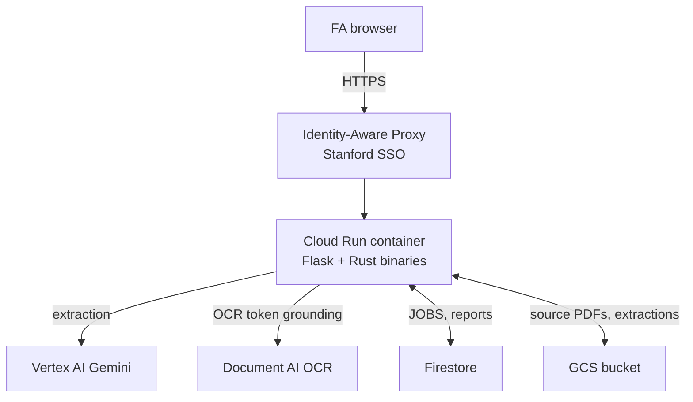

# Onboarding

Entry point for a new maintainer. Reading-order index, not content.
Each step points at the doc or source file to spend time on.

## Scope

Stanford Faculty Administrators (FAs) upload receipt PDFs and
images. The system extracts structured fields with Gemini and
Document AI, validates them against Stanford expense-portal rules,
and emits two CSVs the FA uploads to file the report.

Two non-trivial properties:

- AI extraction must be reliable enough that FAs do not re-key
  fields. Confidence + provenance metadata on every field; FA
  edits supersede extracted values.
- The deployed service must survive Cloud Run container recycles
  without losing FA work. Durable store is Firestore + GCS;
  container disk is a cache.

## Architecture (5 min)



One Cloud Run service. SSO gate via IAP. Vertex AI does the
structured extraction; Document AI provides OCR bboxes used by
the workbench spot-check feature. Firestore + GCS hold durable
state.

## Reading order (30 min)

Each entry assumes the previous.

| # | Doc | Time | Purpose |
|---|---|---|---|
| 1 | `docs/fa-user-guide.md` | 5 min | User-facing surface. Required context for bug triage. |
| 2 | `docs/SPEC.md` §1, §2, §5 | 10 min | Layered architecture and deployment topology. |
| 3 | `docs/internals.md` §1, §1.1, §2, §8 | 10 min | Code layout, data locations, end-to-end pipeline, persistence. |
| 4 | `docs/deploy-cheatsheet.md` | 5 min | Operational facts (URLs, region, IAM). Reference, not study. |

## Source reading order (2 hr)

For a real task (bug fix or feature). Each file is ~30 lines of
focus.

Pipeline (Python):

1. `scripts/local_app_simple.py` — Flask routes + pipeline
   orchestration. ~1600 lines. Search for `@app.`.
2. `scripts/extract_meal.py` — simplest per-kind extractor. ~10
   lines. Calls into:
3. `scripts/extractor_lib.py` — shared Gemini call, retry wrapper,
   multi-call helper. ~250 lines.
4. `scripts/evidence_bbox.py` — Document AI OCR + token-id
   grounding. ~400 lines.

Pipeline (Rust):

5. `src/reduce.rs` — combines per-receipt JSONs into one
   `ExpenseReport`. Pure function.
6. `src/validator_typed.rs` — validates the report. Produces
   issues. Never mutates.
7. `src/workbench_simple.rs` — renders FA-facing HTML. ~2000
   lines, mostly `html.push_str(...)`.
8. `src/csv_export.rs` — emits the two Stanford-portal CSVs.

Type contracts:

9. `schema.yaml` — source of truth for every field shape and
   validation rule.
10. `generated/expense_report_model.rs` — generated Rust types.
    Do not edit.
11. `src/meta.rs` — `Wrapped<T>` and `FieldMetadata`. Every
    extracted field is wrapped with confidence and evidence.

## First-week commands

Auth (once per machine):

```bash
gcloud auth login
gcloud auth application-default login
gcloud config set project soe-agile-agents
```

Setup:

```bash
./.venv/bin/pip install -r deploy/requirements.txt
./.venv/bin/playwright install chromium
cargo build
```

Run locally with the full durable store:

```bash
PORT=8088 VERTEX_PROJECT_ID=soe-agile-agents \
  USE_FIRESTORE_JOBS=1 USE_FIRESTORE_REPORTS=1 USE_GCS_ARTIFACTS=1 \
  ./.venv/bin/python scripts/local_app_simple.py
```

Tests:

```bash
cargo test
./.venv/bin/python -m unittest discover -s tests -p "test_*.py"
```

Prod E2E (real API costs, approximately USD 3 per full suite):

```bash
RUN_PROD_E2E=1 VERTEX_PROJECT_ID=soe-agile-agents \
  ./.venv/bin/python -m unittest tests.test_workbench_browser.TestProdFailureModes -v
```

Deploy:

```bash
git push origin main
```

Cloud Build trigger fires, runs tests, builds image, deploys to
Cloud Run. ~6 minutes to first traffic on the new revision.

When the deploy breaks: `docs/deployment-guide.md` §6.5.

When the FA reports a bug: `docs/fa-user-guide.md` §8. For the
underlying mechanism:

- Workbench bug: `src/workbench_simple.rs`
- Extracted field wrong: `scripts/extract_<kind>.py` and the
  saved JSON at `.scratch/uploads/<id>/extractions/<basename>.json`
- Edit lost after recycle: `_save_report_state` and the Firestore
  doc at `reports/<id>`

## Change cookbook

| Task | Read | Edit |
|---|---|---|
| Add a new expense kind | `internals.md` §4 (13-step checklist) | `schema.yaml`, regenerate, new `extract_*.py`, workbench render arm, validator arm |
| Add a validation rule | `internals.md` §7 | `schema.yaml` for declarative rules; `validator_typed.rs` for procedural |
| Change a workbench field label or format | `internals.md` §7 | `src/workbench_simple.rs` (relevant `render_*` function) |
| Tune Gemini retry behavior | `internals.md` §6.3 | `scripts/extractor_lib.py::RETRY_MAX_ATTEMPTS` and `_retry_with_backoff` |
| Bump extract concurrency | `internals.md` §6.1 | `EXTRACT_MAX_PARALLEL` env var or `extract_all` default |
| Persist a new field across recycle | `internals.md` §8 | `firestore_reports.set_report` and `_rehydrate_upload` |
| Add a deploy env var | `internals.md` §9.4 | `deploy/cloudbuild.yaml` `--set-env-vars` |

If a task is not in the table: read the closest `internals.md`
section.

## Known traps

All have entries in `docs/redesign-regrets.md` with the original
incident.

| Trap | Required behavior |
|---|---|
| Editing `schema.yaml` without regenerating | Run both `generate_schema_artifacts.py` and `generate_response_schema.py`. For per-kind detail-block changes also run `probe_response_schemas.py`. |
| Adding a Firestore field with arrays-of-arrays | JSON-encode as a string. Firestore rejects directly-nested arrays. |
| Inline `python -c` for introspection | Write a script in `scripts/`. The regrets log has 7+ slips on this. |
| Writing to `/tmp` | Use `.scratch/` (gitignored). |
| Trusting `cmd | tee | tail; echo $?` | Exit code is `tail`'s, not `cmd`'s. Inspect output for failure markers or set `pipefail`. |
| Adding HTML5 validation without Playwright load test | Chromium `/v` mode is stricter than JS `/u`. `tests/test_workbench_browser.py::test_upload_form_loads_with_all_fa_fields` is the guard. |
| Editing `src/workbench_simple.rs` HTML without an eyeball | Render a fixture and open in a browser. `cargo test` does not catch visual bugs. |

## Debugging path

In priority order:

1. Search `docs/redesign-regrets.md`. Many recurring failure
   modes are documented with the original incident.
2. Run the full prod E2E suite. If it passes, the issue is local
   to the change. If it fails, the failure indicates the regression.
3. Read Cloud Logging. Every meaningful event is structured via
   `scripts/log_event.py`. Filter on `jsonPayload.event`.
4. Read source files in the order from the deep-dive section
   above. The code is approximately 5K lines of Python and Rust.

## Out of scope

- Formal API reference. Flask routes are the API; read
  `scripts/local_app_simple.py`. Approximately 15 routes.
- Schema dictionary. `schema.yaml` is short enough to read in 5
  minutes and is the source of truth. Any docstring would drift.
- Separate Rust crate doc. Modules in `src/` have one-sentence
  header docs; read the file.
- Diagrams-as-code repo. Mermaid blocks live inline in the docs
  that need them. GitHub renders them.

Documentation that drifts is worse than no documentation. The
code plus the doc set listed above is the contract.
