# Expense Report Automation System Architecture

## Recommendation in one sentence

Keep the rough flow you described, but do **not** go directly from uploaded documents to final YAML. For robustness, the system should pass through four explicit layers: **artifact normalization**, **document-level fact extraction with evidence**, **deterministic enrichment + policy validation**, and **human-reviewed FA handoff**.

## Goals

- Accept reimbursement packets containing PDFs and PNGs.
- Convert each document into a machine-usable representation that is friendly to LLMs.
- Populate the current expense report schema.
- Present the result in a format that is easy for a faculty administrator to transfer into Stanford’s site.
- Capture corrections, returns, and site feedback so the system improves over time.
- Optimize for robustness, auditability, and low rejection risk rather than maximum automation.

## Non-goals for V1

- Fully automated submission into Oracle or any Stanford financial system.
- Silent auto-filling of low-confidence or payee-only fields.
- Using YAML as the only internal system of record.

## Why the current schema pushes toward a layered design

The current schema already distinguishes:

- `T1` payee-provided fields
- `T2` system-generated fields
- `T3` system-inferred fields

It also includes:

- conditional requiredness
- cross-field dependencies
- deterministic computations such as totals, exchange rates, and per-diem summaries
- per-field metadata for confidence, source document, and flags

That means the architecture should mirror the schema instead of asking one LLM call to do everything.

## Core design principles

1. **Schema-first**: `schema.yaml` is the contract. Extraction prompts, validators, UI labels, and export mappings should all derive from it.
2. **Evidence-first**: every inferred value must point back to a document, page, and text span.
3. **Deterministic where possible**: all `T2` fields should be computed in code, not generated by an LLM.
4. **Abstain instead of guessing**: low-confidence fields should become review tasks, not hidden model guesses.
5. **Immutable artifacts**: every upload, OCR result, extraction result, validation report, and FA correction should be versioned and reproducible.
6. **Human-gated submission**: V1 should produce a high-quality draft and review surface, not a blind auto-submit.

## High-level architecture

```mermaid
flowchart LR
    A[Upload UI / API] --> B[Ingestion Service]
    B --> C[Object Store: raw files]
    B --> D[Postgres: bundle + job metadata]
    B --> E[Workflow Orchestrator]

    E --> F[Preprocess Service]
    F --> G[Normalized pages + file fingerprints]

    E --> H[OCR / VLM Transcription]
    G --> H
    H --> I[Markdown + layout anchors + page images]

    E --> J[Document Understanding]
    I --> J
    J --> K[Document facts + evidence graph]

    E --> L[Report Synthesizer]
    K --> L
    L --> M[Draft canonical report object]

    E --> N[Deterministic Enrichment]
    M --> N
    N --> O[Rates, totals, keys, derived fields]

    E --> P[Validation + Risk Engine]
    O --> P
    P --> Q[Validated draft + issues]

    Q --> R[FA Review Workbench]
    R --> S[Copy/Paste View for Stanford site]
    R --> T[Correction + feedback capture]

    T --> U[Training / Evaluation Dataset]
```

## Recommended system layers

### 1. Ingestion and artifact storage

Each upload creates a `bundle_id`. The bundle is the immutable container for:

- raw uploaded files
- file hashes
- upload timestamps
- user identity
- processing runs

Store raw files in object storage and metadata in Postgres.

Key robustness features:

- deduplicate identical files by hash
- preserve original filenames
- keep all processing outputs versioned under the same `bundle_id`
- make all jobs idempotent

### 2. Preprocessing and normalization

Convert every input into a consistent page-level representation.

For PDFs:

- if the PDF has a text layer, extract it with a deterministic parser
- also render page images for layout-sensitive extraction
- compare native PDF text with VLM OCR when fields are critical

For PNG/JPEG:

- standardize orientation, resolution, and color mode
- detect rotation and skew
- split multi-receipt images if needed later, but keep original intact

Output artifacts:

- `pages/<page>.png`
- `native_text.json` when available
- `document_manifest.json`
- document fingerprints and page counts

### 3. OCR / transcription layer

Use a VLM-based OCR stage, but do not store only free-form markdown.

Recommended output per document:

- `document.md`
- `layout.json` with page, block, bbox, and reading order
- `ocr_confidence.json`

The markdown should be optimized for LLM consumption:

- one page at a time
- stable page headers
- normalized tables
- explicit currency/date formatting when recognized

But the layout JSON is equally important because markdown alone loses evidence anchors.

### 4. Document classification and fact extraction

Before synthesizing the whole report, extract facts from each document independently.

Classify documents into types such as:

- receipt
- booking confirmation
- conference registration
- conference program
- hotel folio
- itinerary
- missing receipt form
- currency conversion
- price comparison
- other

Then extract document-local facts with evidence references, for example:

- itinerary dates, airports, traveler name
- hotel name, stay dates, nightly rate
- registration fee, conference dates, meals included
- receipt date, merchant, currency, amount

This stage should produce a **document fact object**, not final report YAML.

Suggested runtime contract:

- `ExtractedDocumentFacts`
- `DocumentClassification`
- `Observed<T>` for evidence-bearing normalized values
- `DocumentFactsPayload::{FlightItinerary, HotelFolio, Receipt, ...}`

The concrete Rust model for this now lives in [src/document_facts.rs](/Users/adityasriram/Labs/stanford/research/expense-reports/src/document_facts.rs:1), with a design note in [document-facts.md](/Users/adityasriram/Labs/stanford/research/expense-reports/document-facts.md:1).

Why this matters:

- it localizes failures
- it makes retries cheap
- it supports multi-document corroboration
- it lets you improve one document parser without changing the entire report pipeline

### 5. Case graph / bundle synthesis

Merge document facts into a bundle-level canonical graph:

- `Payee`
- `Trip`
- `Event`
- `ExpenseLine`
- `Approver`
- `Beneficiary`
- `DocumentEvidence`

This is the stage where the system answers questions like:

- which receipts belong to the same trip
- whether the trip is domestic or foreign
- which conference registration and program belong together
- whether a lodging receipt overlaps the conference dates
- whether multiple docs refer to the same airfare line

This stage should also detect unresolved conflicts, such as:

- two different trip date windows
- different spellings of the payee name
- receipt total not matching converted amount
- conference program present but payee missing from agenda

The first Rust implementation of this layer now lives in [src/bundle_synthesis.rs](/Users/adityasriram/Labs/stanford/research/expense-reports/src/bundle_synthesis.rs:1), with usage notes in [bundle-synthesis.md](/Users/adityasriram/Labs/stanford/research/expense-reports/bundle-synthesis.md:1).

### 6. Schema projection

Project the canonical graph into the expense report schema.

Important recommendation:

- internally, store the draft as a typed object or JSONB record
- render YAML only as an export and review representation

This avoids fragile parsing and makes validation much safer.

The output at this stage should follow your schema shape and attach metadata like:

- confidence
- evidence references with document/page/span provenance
- needs review
- flags

### 7. Deterministic enrichment for `T2` fields

Everything marked `T2` in the schema should come from deterministic services or code:

- `payment_method`
- `key_30char`
- `transaction_number` when available
- `total_usd`
- `exchange_rate`
- airfare price comparison generation
- `number_of_nights`
- per diem rates and meal deductions
- reimbursement summaries

This is where you integrate trusted reference services:

- historical FX rate source
- GSA / State Department per diem source
- internal mapping tables for event naming or lab naming if needed

The LLM should never invent rates or derived totals.

### 8. Validation and risk engine

This is the most important robustness layer after evidence capture.

The validator should operate in four passes:

1. **Schema validation**
   - required fields present
   - correct types
   - enum membership

2. **Conditional validation**
   - foreign reports require currency fields
   - presenting-at-conference requires supporting program evidence
   - shared lodging requires linked transaction number

3. **Cross-document consistency**
   - line dates fall within trip window
   - totals match receipt and converted values
   - payee name is consistent across itinerary, hotel, and program
   - conference dates align with registration/program

4. **Policy/risk rules**
   - ticket class above coach
   - alcohol present on receipt but not disclosed
   - personal nights likely included
   - missing receipt form required
   - missing evidence for a claimed justification

The output should be a machine-readable issue list with severity:

- `blocking`
- `review_required`
- `warning`
- `info`

### 9. FA review workbench

V1’s operational product should be a review UI, not only a YAML file.

The review workbench should have four panes:

1. **Packet summary**
   - payee, event, trip dates, report total, confidence summary

2. **Issues queue**
   - missing fields
   - conflicts
   - policy flags
   - low-confidence inferences

3. **Evidence viewer**
   - source document preview
   - page/line highlight
   - extracted markdown side-by-side with original image

4. **Oracle copy/paste view**
   - fields ordered exactly like the Stanford site
   - one-click copy for business purpose, event name, line remarks, totals, and line items
   - attachment checklist per line item

The current Rust backend implementation of this handoff now has two layers:

- the typed review artifact in [src/review_packet.rs](/Users/adityasriram/Labs/stanford/research/expense-reports/src/review_packet.rs:1), documented in [review-packet.md](/Users/adityasriram/Labs/stanford/research/expense-reports/review-packet.md:1)
- a deterministic static HTML renderer in [src/review_workbench.rs](/Users/adityasriram/Labs/stanford/research/expense-reports/src/review_workbench.rs:1), documented in [review-workbench.md](/Users/adityasriram/Labs/stanford/research/expense-reports/review-workbench.md:1)

It is not yet an interactive web app, but it already produces both the stable typed contract and a concrete FA-facing presentation.

This UI should explicitly separate:

- machine-filled fields
- computed fields
- fields the FA must confirm or manually enter

### 10. Feedback capture and continuous improvement

Do not treat FA corrections as noise. Treat them as the main learning signal.

Capture:

- original machine value
- final human-corrected value
- correction reason
- whether the Stanford site rejected or accepted the entry
- return reason if known
- whether the issue was OCR, extraction, policy, or UI-mapping related

Suggested correction taxonomy:

- OCR error
- wrong document classification
- wrong expense type classification
- wrong cross-document merge
- missing required field
- wrong derived field
- Stanford policy mismatch
- Stanford site workflow mismatch
- unclear or undocumented rule

This gives you both a training set and a policy gap backlog.

The current Rust backend implementation of this layer now lives in:

- [src/feedback.rs](/Users/adityasriram/Labs/stanford/research/expense-reports/src/feedback.rs:1) for typed correction and submission feedback artifacts
- [src/feedback_regression.rs](/Users/adityasriram/Labs/stanford/research/expense-reports/src/feedback_regression.rs:1) for fixture-backed regression coverage
- [feedback-capture.md](/Users/adityasriram/Labs/stanford/research/expense-reports/feedback-capture.md:1) for usage notes and example commands

The versioned workflow wrapper around that stage now also lives in:

- [src/ledger.rs](/Users/adityasriram/Labs/stanford/research/expense-reports/src/ledger.rs:1) for draft versions, review actions, submission attempts, and site-return revisions
- [src/ledger_regression.rs](/Users/adityasriram/Labs/stanford/research/expense-reports/src/ledger_regression.rs:1) for fixture-backed workflow regressions
- [review-submission-ledger.md](/Users/adityasriram/Labs/stanford/research/expense-reports/review-submission-ledger.md:1) for usage notes and example commands

## Recommended internal data model

At minimum:

- `bundles`
- `documents`
- `document_pages`
- `processing_runs`
- `document_facts`
- `evidence_spans`
- `report_drafts`
- `validation_issues`
- `review_actions`
- `submission_attempts`
- `submission_feedback`

Each report draft should be versioned. Never overwrite the only copy.

## State machine

Recommended bundle lifecycle:

`uploaded -> normalized -> transcribed -> doc_facts_ready -> draft_ready -> validated -> needs_review | ready_for_fa -> submitted -> accepted | returned`

If the FA edits anything, create a new draft version rather than mutating history invisibly.

That recommendation is now implemented concretely in the review/submission ledger layer above.

## Synthetic evaluation harness

The current repo also has a deterministic large-corpus evaluation harness for the downstream spine:

- [src/synthetic_corpus.rs](/Users/adityasriram/Labs/stanford/research/expense-reports/src/synthetic_corpus.rs:1)
- [src/corpus_eval.rs](/Users/adityasriram/Labs/stanford/research/expense-reports/src/corpus_eval.rs:1)
- [synthetic-corpus-evaluation.md](/Users/adityasriram/Labs/stanford/research/expense-reports/synthetic-corpus-evaluation.md:1)

That harness currently stress-tests:

- document extraction on diverse synthetic flights, hotels, and receipts
- bundle synthesis and validation/readiness
- review packet and workbench rendering
- versioned review/submission ledger flows for both accepted and returned submissions

## Robustness mechanisms that matter most

### Confidence gating

Use strict thresholds:

- `high`: can be prefilled without blocking
- `medium`: prefill but mark for review
- `low`: do not prefill into the copy surface without explicit FA confirmation

Critical fields like amount, currency, dates, payee name, and expense type should require either:

- high model confidence, or
- corroboration from multiple documents, or
- human review

### Dual extraction for critical fields

For key financial fields, run a second check:

- compare native PDF text extraction with VLM OCR
- or use a lightweight verifier prompt against the original page image

This is cheaper than dealing with downstream rejections.

### Deterministic formatting

Normalize:

- dates to ISO internally
- currencies to ISO currency codes
- airports to IATA where applicable
- amounts to decimal strings before numeric parsing

### Strict model versioning

Record for every run:

- OCR model version
- reasoning model version
- prompt version
- schema version
- validator version

Without this, regressions will be hard to diagnose.

### Manual fallback path

Any bundle should be recoverable by the FA even if extraction is poor.

The system should still provide:

- organized attachments
- OCR markdown
- detected document types
- missing-information checklist

That way the system is useful even on hard cases.

## Why not use direct YAML generation as the main system boundary

YAML is a good review and interchange format, but it is a weak systems boundary for a financial workflow because:

- parsing failures are easy to introduce
- partial invalid states are harder to reason about
- typed validation is awkward
- evidence links are harder to manage cleanly

Recommended pattern:

- LLM outputs structured JSON for doc facts and report drafts
- validators operate on typed objects
- the system renders YAML for review/export

This still preserves your desired markdown -> schema-based draft flow, but with much better robustness.

## Suggested implementation stack

One reasonable starting stack:

- API/backend: FastAPI
- workflow orchestration: Temporal or a durable job runner
- metadata/state: Postgres
- file/artifact storage: S3-compatible object store
- review UI: React
- typed validation: Pydantic + custom rules engine generated from `schema.yaml`
- observability: OpenTelemetry-compatible traces + structured logs

The exact tools are less important than keeping the artifact boundaries explicit.

## V1 rollout plan

### Phase 1: offline extraction pipeline

Build:

- upload handling
- normalization
- OCR markdown + layout output
- document classification
- document fact extraction

Success metric:

- high recall on core facts from a small gold set of historical packets

### Phase 2: schema projection + validation

Build:

- canonical graph
- schema projection
- deterministic `T2` services
- issue generation

Success metric:

- draft reports are mostly complete and validation catches obvious failures before FA review

### Phase 3: FA review workbench

Build:

- evidence viewer
- Oracle-ordered copy view
- correction capture

Success metric:

- FA review time drops materially
- correction logs are structured and reusable

### Phase 4: feedback-driven hardening

Build:

- error taxonomy dashboard
- golden test set
- regression evaluation by field and document type
- return reason analytics

Success metric:

- declining review burden
- declining return/rejection rate
- stable behavior across model upgrades

## Open questions to resolve next

1. What exact Stanford site fields and page order should the FA copy surface mirror?
2. Which fields are truly safe to infer versus must always be confirmed by the payee or FA?
3. What trusted source should provide historical FX and per-diem rates?
4. How should the system collect missing `T1` fields, such as attendee names or beneficiary data?
5. Should the same upload bundle ever contain multiple expense reports, or is one bundle always one report?
6. What is the desired behavior for unresolved conflicts: block the bundle, or let the FA override with rationale?
7. How should `mileage_expenses` be represented once that schema section is defined?

## Immediate recommendation for this project

The best next step is to convert `schema.yaml` into three generated artifacts:

- a typed internal report model
- a validation rule set
- a UI field map for the FA review workbench

That will force the rest of the architecture to stay aligned with the schema you already have.
